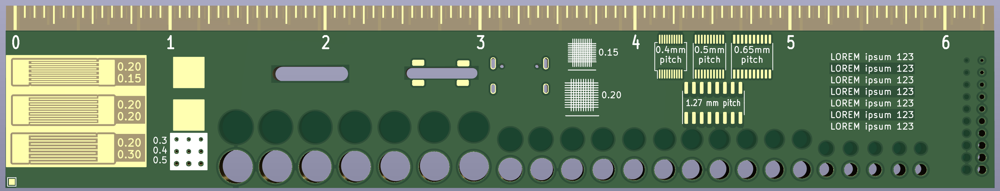

# Aisler Ruler

This is a draft of the kind of ruler I'd be interested in. It's not only a device for determinig suitable holes for parts but also showcases the capabilities of the fab and the limits of the basic/simple class of service.

#### Front

#### Back

### Ruler
- mm and inch (1/16th) measurement (or else it wouldn't be a ruler)

### Holes, plated and unplated
- Holes 0.5-1.4 mm for testing component lead sizes
- Holes 1.9-2.3 mm for M2 screws
- Holes 2.9-3.9 mm for 3mm LED and tactile switches on front panels. Also M3
- Holes 4.9-5.5 mm for 5mm LED

### Fonts
- Test of regular font sizes
- Test of inverted "Buzzard" font sizes

### Slots
- Plated slots for USB-C
- 1.8mm unplated slot with solder tabs for testing two PCBs joined 90 degrees
- 2.4mm unplated slot for...

### Naked HASL quality
- Test for solderbridges at soldermaskless traces for 200/150 200/200 200/300um

### Silkscreen resolution
- Test grid at 0.15 and 0.20 mm tracewidth/pitch

### Solderdams
- Availability of solder dams at 0.4, 0.5, 0.65 and 1.27 pitch tssop/soic

### Transparency of soldermask
- Test text on copper respective non-copper

### Transparency of naked FR-4 material
- Test transpareny for backlit LED indicators

### Quality tented vias
- How much soldermask and silkscreen will be applied

